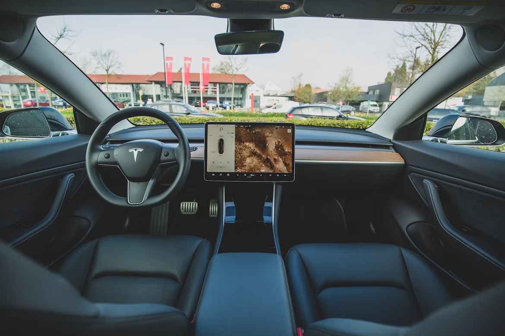

# Abstraction

## Interface vs Implementation

We can see the idea of implementing in modern electric cars. For instance, consider the picture below of the cabin of a Tesla:

In this image, you can see a steering wheel. Below the steering wheel, you can see a brake pedal on the left, and an accelerator on the right. Often, the right pedal is referred to as the "gas pedal". This is because in an internal combustion engine car, the pressing the pedal down causes more gasoline ("gas" being an American parlance for gasoline) and oxygen into the engine, allowing for a more powerful explosion that causes the engine to turn faster. However, in an electric car, there is no "gas". However, for most American drivers, if I asked "which pedal is the gas pedal", they would say the pedal on the right. That's because we don't think of the pedal based on **how it works**; instead, we think of the pedal based on **what it does**. That is, we care about the **interface**, not the **implementation**.

That is, modern electric cars try to mimic the interface that drivers are used to. This allows drivers to be able to drive an electric car the same way they drive an internal combustion or hybrid car. This means a driver can switch from one to the other, and have to understand as little new information as possible.

## Violation of Abstraction

## Using Information Hiding